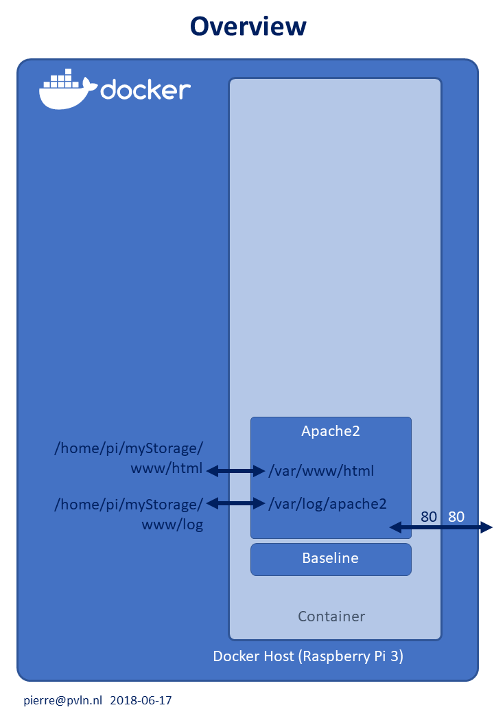

Configs en scripts to create an Apache2 container on top of Baseline image on Raspberry Pi 3

__Docker configuration files:__
* Dockerfile_short : configuration as add-on to a previous container (a short file)
* Dockerfile       : holds all configuration info in one file (a long file)

