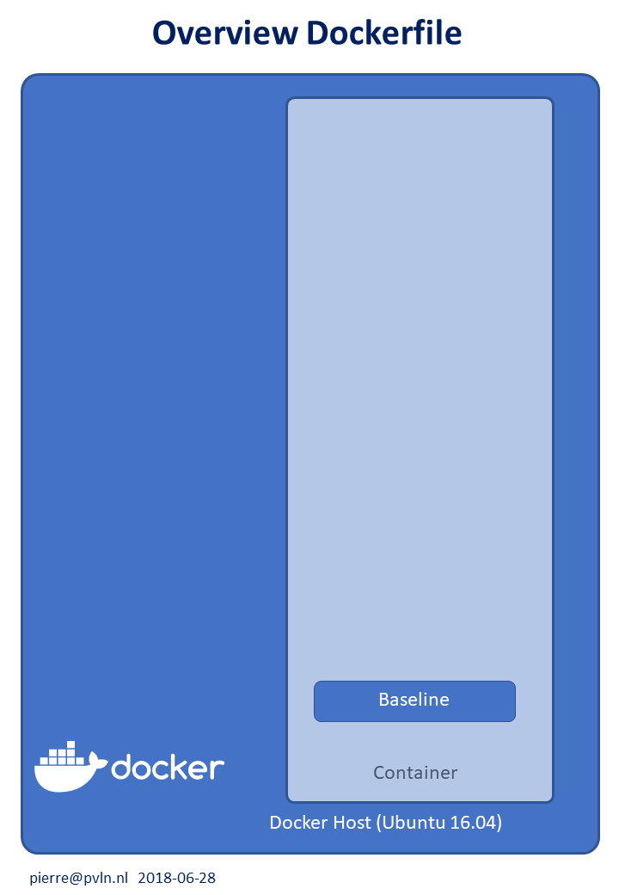

Configs en scripts to create a Baseline container image on Ubuntu 16.04

This Docker files creates the baseline image with standard utilities:
- sudo
- apt
- ssh
- nano
- net-tools
- locale

__Docker configuration files:__
* Dockerfile_short : configuration as add-on to a previous container (a short file)
* Dockerfile       : holds all configuration info in one file (a long file)

