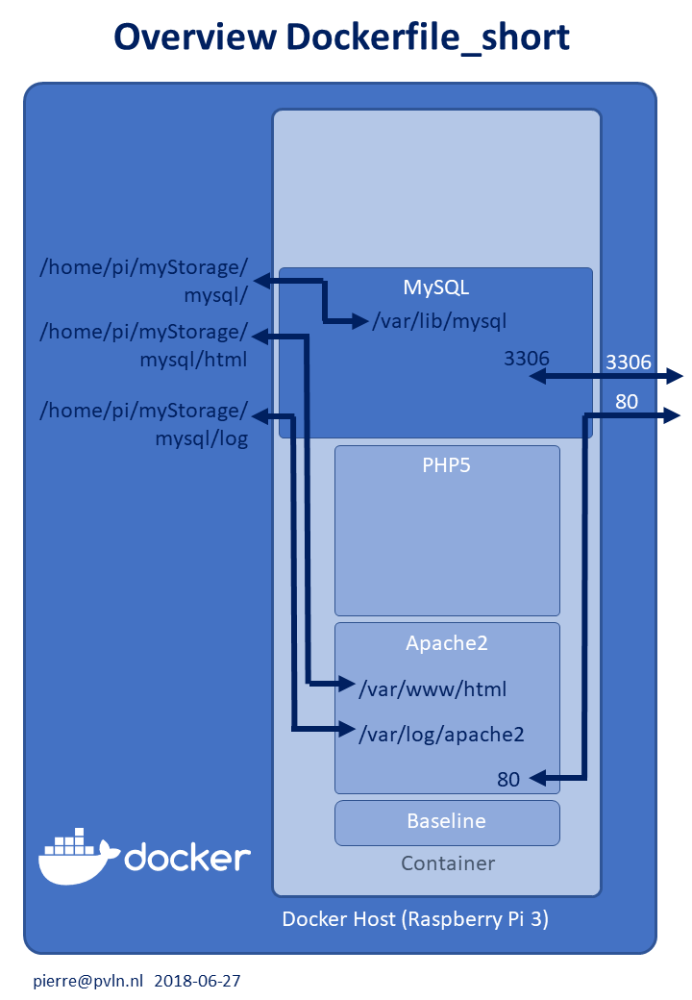
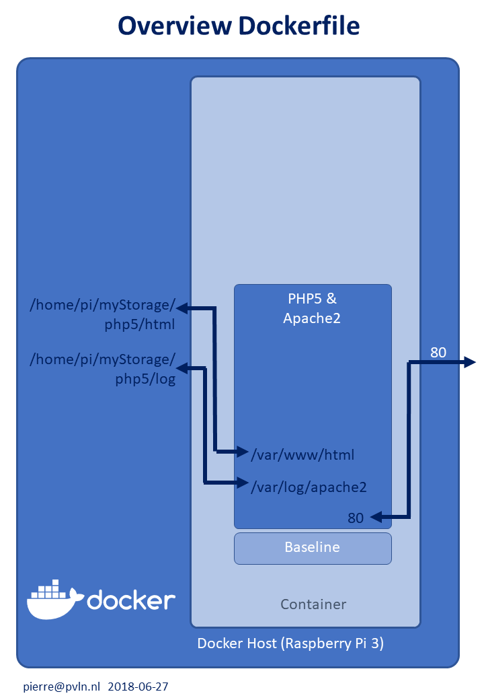

Configs en scripts to create an PHP5 container on top of Apache2 image for Ubuntu 16.04

__Docker configuration files:__
* Dockerfile_short : configuration as add-on to a previous container (a short file)
* Dockerfile       : holds all configuration info in one file (a long file)

